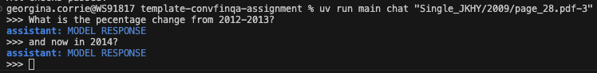

# ConvFinQA Assignment


Thank you for taking the time to do this assignment! Please see the [main Notion page](https://tomoroai.notion.site/Technical-Assignment-1fa0de3387ea80debb36cda4ae41e93d) for the full instructions. 


We have cleaned up the dataset; please see `dataset.md` for more information. We recommend you use this version of the data for the assignment, as it will save you a lot of time. If you have any questions, please don't hesitate to ask your point of contact. 


Good luck! 

## Get started
### Prerequisites
- Python 3.12+
- [UV environment manager](https://docs.astral.sh/uv/getting-started/installation/)

### Setup
1. Clone this repository
2. Use the UV environment manager to install dependencies:

```bash
# install uv
brew install uv

# set up env
uv sync

# add python package to env
uv add <package_name>
```

### [optional] Use CLI to chat

We have created a boilerplate cli app using [typer](https://typer.tiangolo.com/) (sister of fastapi, built on click) so there is a simple chat interface, which you can extend to meet your needs if you so choose.  By default the chat responds with a standard message as shown below.


We've installed the app as a script, so you can run it with:
```bash 
uv run main
```
or you can use the longer form:
```bash
uv run python src/main.py
```

How to *chat*:
```bash
uv run main chat <record_id> 
```
[](figures/chat.png)  

## Submission 
Please make a submission branch & make a PR to main. The PR should contain: 


- A solution to the main task
- A report summarising your findings. We have sketched out a template for you in `REPORT.md`, but you can use any other setup (like LaTeX) if you prefer.
- Please send a link to the PR to [recruitment@tomoro.ai](mailto:recruitment@tomoro.ai) with the subject `submission: <your name>`.
  
NOTE: Please DO NOT merge any of your submission to main, all of your work should be on your branch `submission`. 


**Please let us know if you used any AI tools to help generate code for your assignment.**
Using AI-powered IDEs or coding assistants is acceptable, as these are commonly used in real-world environments, and this assignment is intended to reflect that. If you’ve used AI tools to help you write code or your report, or any other part of your process, we ask that you disclose how and where you used them. This isn’t to catch you out. It’s an opportunity to show that you understand how to use these tools effectively and responsibly as part of your workflow.

