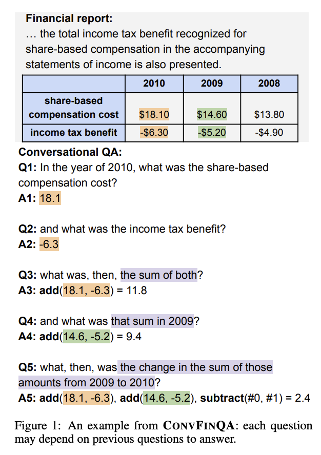
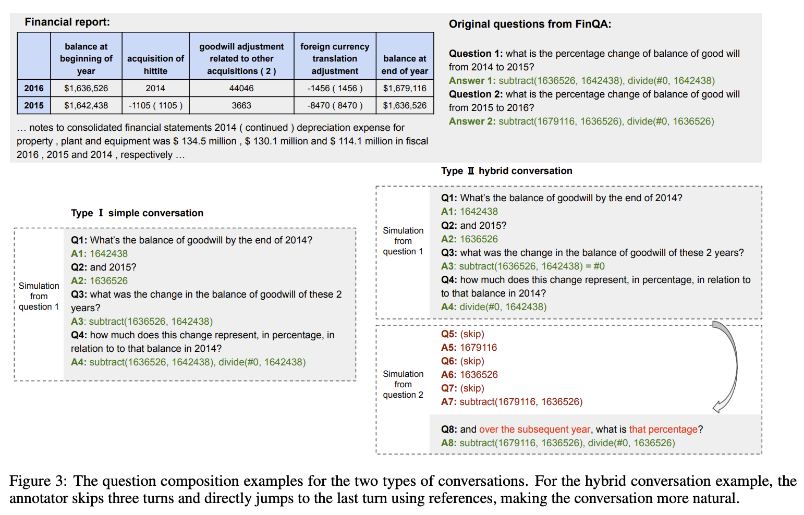
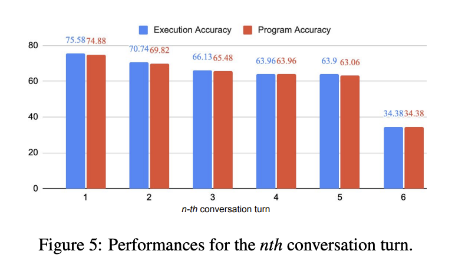

# Dataset Card

## Table of Contents
- [Summary](#summary)
- [Useful Extracts from the Paper](#useful-extracts-from-the-paper)
  - [Types of Question](#types-of-question)
- [Dataset Statistics](#dataset-statistics)
- [Baselines](#baselines)
  - [Human Baselines](#human-baselines)
  - [Model Baselines](#model-baselines)
    - [Statistics](#statistics)
    - [Analysis from the Paper](#analysis-from-the-paper-section-53)
- [Dataset Structure](#dataset-structure)
  - [Data Fields](#data-fields)
  - [Cleaning Process](#cleaning-process)

## Summary 
This dataset is a cleaner version of the original dataset from the [ConFinQA repo](https://github.com/czyssrs/ConvFinQA). This dataset consists of conversational numerical reasoning questions over unstructured financial documents, containing datatables. 

## Useful Extracts from the Paper
> CONVFINQA (Conversational Finance Question Answering), with 3,892 conversations consisting of 14,115 questions. To construct the dataset, we design a framework to simulate the conversation flow by decomposition and concatenation of the multihop questions from the FinQA dataset.

> In our CONVFINQA dataset, the major challenge is to learn the chain of numerical reasoning throughout the conversation turns.

A sample example:



### Types of Question: 
- **Type I: Simple conversation**: we take one muti-hop question and decompose its reasoning program into single steps – each reasoning step will then be realized into one question as one conversation turn. 
- **Type II: Hybrid conversations**: We take two multi-hop questions about the same report and break down their reasoning steps. Then, we add a number selection steps like in type I conversations. By combining the steps from both questions, we build a full conversation that reflects someone asking about two related aspects of the same report. Since these aspects are often connected, the resulting conversation includes longer reasoning chains across turns.



## Dataset Statistics
>We end up with 3,892 conversations containing 14,115 questions. We split the
dataset into 3,037/421/434 for train/dev/test sets.
2,715 of the conversations are simple conversations,
and the rest 1,177 are hybrid conversations.

| Split | Conversations | Questions |
|-------|----------------|-----------|
| Train | 3,037          | —         |
| Dev   | 421            | —         |
| Test  | 434            | —         |
| **Total** | **3,892**      | **14,115**   |


## Baselines

### Human Baselines 
> To evaluate the quality of CONVFINQA and establish human performance references, we sample 200 example questions and distribute to both the expert and laymen
annotators to answer. 

| Annotator                        | Exe Acc |
|----------------------------------|---------|
| **Human Expert Performance**         | **89.44**   |
| General Crowd Performance        | 46.90   |


### Model Baselines 
#### Statistics

| Model           | Method                | Exe Acc |
|------------------|-------------------------------|---------|
| GPT-3  | answer-only-prompt            | 24.09   |
| GPT-3   | CoT prompting                 | 40.63   |
| GPT-3   | DSL program* | 45.15   |
| FinQANet(RoBERTa-large)** | DSL program | **68.90** |

*Referred to as: `Program-normal-DSL` prompting in the paper

**Proposed in FinQA, it is a pipeline approach with a retriever to first retrieve the supporting facts from the input financial report, then a generator to generate the DSL program to get the answer.
Note: all methods in this baseline table had a retrieval step, not just FinQANet.
#### Analysis from the Paper (Section 5.3): 
> The model [FinQANet] excels at number selection questions.
For the number selection questions depending on
previous references, e.g., what is that value in the
subsequent year?, the model is mostly able to answer. Also, the model is mostly clear on when to
discard the previous context and make the transition to new questions.

> The model [FinQANet] suffers from the lack of domain
knowledge. The lack of financial knowledge
leads to many errors of missing retrieval facts,
wrong value selections, and wrong mathematical
generations. Nonetheless, the current large pretrained models do see financial corpus during pretraining; we still need to endow the system with
stronger domain knowledge for tasks requiring
high-level, complex domain reasoning abilities.

> The model [FinQANet] struggles with long reasoning chains.
For the later question turns in a conversation that
demonstrate longer reasoning dependencies to the
previous context, the model often struggles with
deducting the correct reasoning programs. If the
prediction for any turn is wrong, then there is a very
minor chance that the subsequent turns are correct.

> Later turns in the conversations [by FinQANet] tend to be harder to answer due to longer reasoning dependencies. [See figure 5.]




## Dataset Structure 

### Data Fields

```python
class ConvFinQARecord(BaseModel):
    id: str = Field(description="The id of the record")
    doc: Document = Field(description="The document")
    dialogue: Dialogue = Field(description="The conversational dialogue")
    features: Features = Field(description="The features of the record, created by Tomoro to help you understand the data")


class Document(BaseModel):
    pre_text: str = Field(description="The text before the table in the document")
    post_text: str = Field(description="The text after the table in the document")
    table: dict[str, dict[str, float | str | int]] = Field(
        description="The table of the document as a dictionary "
    )


class Dialogue(BaseModel):
    conv_questions: list[str] = Field(
        description="The questions in the conversation dialogue, originally called 'dialogue_break'"
    )
    conv_answers: list[str] = Field(
        description="The answers to each question turn, derived from 'answer_list' and original FinQA answers"
    )
    turn_program: list[str] = Field(
        description="The DSL turn program for each question turn"
    )
    executed_answers: list[float | str] = Field(
        description="The golden program execution results for each question turn"
    )
    qa_split: list[bool] = Field(
        description="This field indicates the source of each question turn - 0 if from the decomposition of the first FinQA question, 1 if from the second. For the Type I simple conversations, this field is all 0s."
    )


class Features(BaseModel):
    num_dialogue_turns: int = Field(
        description="The number of turns in the dialogue, calculated from the length of conv_questions"
    )
    has_type2_question: bool = Field(
        description="Whether the dialogue has a type 2 question, calculated if qa_split contains a 1 this will return true"
    )
    has_duplicate_columns: bool = Field(
        description="Whether the table has duplicate column names not fully addressed during cleaning. We suffix the duplicate column headers with a number if there was no algorithmic fix. e.g. 'Revenue (1)' or 'Revenue (2) "
    )
    has_non_numeric_values: bool = Field(
        description="Whether the table has non-numeric values"
    )
```


### Cleaning Process

The original data is in a messy disorganised state with a lot of errors in the original OCR process. We have cleaned it for you for the purpose of this task. Though it is not perfect.


**Tables:** 
- Fix duplicate column headers, either by inspecting the original table or by suffixing the duplicate column headers with a number if there was no algorithmic fix. e.g. 'Revenue (1)' or 'Revenue (2)'
- Convert all values to numeric where applicable, e.g. negative values are sometimes written as '(12345)' or '-12345 (12345)' when they should be -12345.0

**Dialogue:** 
- Answer list is now the correct length and corresponds to the number of the dialogue questions
- Answer list contains the correct answers for each conversational question instead of placeholder values located in multiple places
